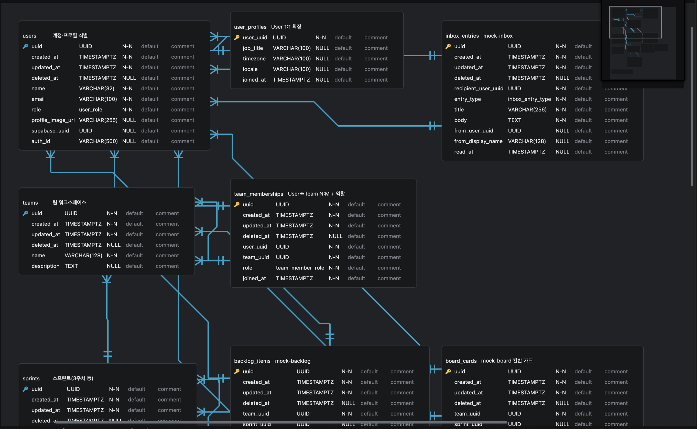
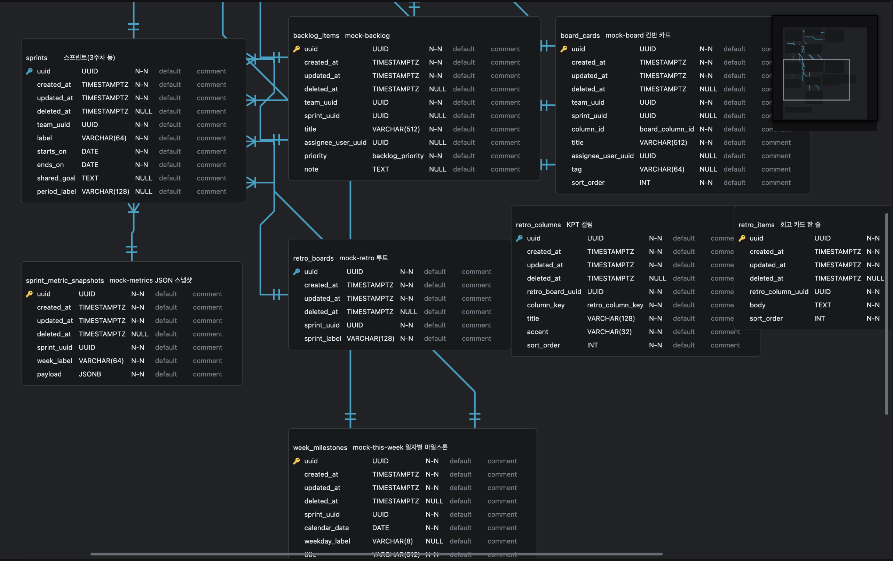

# Conflow

**"PM · Comms · HR · 문서발급을 하나로 잇는 엔터프라이즈 협업 OS"**

Jira · Slack · Workday · Gusto로 흩어진 회사 운영을 **한 데이터 모델 위에** 통합합니다.
SMB(10-200명) beachhead에서 미드마켓(200-2000명)으로 확장하는 **올인원 협업 플랫폼**이며, 도메인 횡단 AI 에이전트(A2UI)가 회사 운영의 가시성과 자동화를 제공합니다.

> 📌 2026-06-24 엔터프라이즈 피벗 진행 중. 신규 제품 전략은 [`docs/`](./docs/) 참고.

## The Problem & Solution (비즈니스 로직)

| 문제점 (Pain Points)                                          | 해결책 (Our Solutions)                                               |
| ------------------------------------------------------------- | -------------------------------------------------------------------- |
| 도구 사일로(Jira · Slack · Workday)로 끊긴 의사결정 흐름      | PM · Comms · HR을 **하나의 데이터 모델**에 통합 — 컨텍스트 전환 제거 |
| 인사 · 근태 · 문서발급에 매주 흩어지는 운영 시간              | HR 도메인 내장 + 전자서명 / 급여명세서 / 재직증명 자동 발급          |
| CEO가 답하지 못하는 "지금 회사에서 가장 큰 블로커가 무엇인가" | 도메인 횡단 AI 에이전트(A2UI)가 전사 운영 가시성을 실시간 요약       |

## 3. Engineering Excellence (기술적 차별점)

### 🏗 Pragmatic FSD Architecture

단순 폴더 구조를 넘어, 비즈니스 확장을 고려한 Layered Monorepo 구조를 채택했습니다.

- **Core:** 인프라와 외부 어댑터 분리 (Adapter Pattern 적용)
- **Business:** UI와 완전히 분리된 Headless Logic (A2UI 도입 가능성 확보)
- **UI:** 원자적 디자인 시스템 기반의 재사용성 극대화

### 🤖 A2UI-Ready Design

모든 Feature는 독립적인 함수로 설계되어, 향후 AI 에이전트가 사람의 개입 없이도 비즈니스 로직을 실행하고 결과를 UI 스키마로 반환할 수 있는 구조를 갖추고 있습니다.

## 4. Tech Stack (The "Why")

- **TanStack Start (SSR):** 대시보드의 초기 로딩 속도 최적화 및 SEO/Type-safety 확보.
- **pnpm + Turborepo:** 패키지 간 의존성 관리 효율화 및 빌드 속도 향상.
- **Zod:** AI와 외부 API로부터 들어오는 데이터의 무결성을 보장하는 강력한 검증 레이어.

## 5. Roadmap (MVP Focus)

- [x] **Phase 1 (MVP):** 대시보드, 이번 주 할 일, Blocker 추적 (목 데이터 기반)
- [ ] **Phase 2:** AI 기반 회의록 요약 및 자동 할 일 할당 (A2UI 실제 적용) — LangGraph `meeting_summary` 로컬 구성 중 ([에이전트 목적](docs/agent-purpose.md))
- [ ] **Phase 3:** Slack/Discord 연동 어댑터 구현

## 6. Sandbox Security

To ensure the safe and controlled execution of AI agent actions and to protect the underlying system from unintended modifications, Conflow implements a robust sandbox environment. This security layer is crucial for our **A2UI-Ready Design**, allowing AI features to operate without compromising system integrity.

### Key Components:

- **`server/src/app/sandbox/utils.py`**: This utility module provides foundational security checks, primarily focusing on file system operations. It includes:
  - **Path Validation (`validate_path`)**: Prevents directory traversal attacks and ensures all file accesses are confined within designated safe directories (e.g., user's project root).
  - **File Type Restrictions (`is_allowed_file_type`)**: Ensures that only approved file types can be processed or generated by the agent.
  - **Write Size Limits (`check_write_limit`)**: Prevents the creation of excessively large files that could consume system resources.
  - **Temporary File Management (`create_temp_file`)**: Securely handles the creation of temporary files within the sandbox.

- **`server/src/app/sandbox/security_manager.py`**: This is a core runtime security component that actively intercepts and controls potentially dangerous Python operations. It employs various techniques, including:
  - **Function Overrides**: Intercepts and replaces built-in functions (`open`) and module functions (`os.system`, `subprocess.Popen`, `socket.socket`, `requests`) with secure, audited versions.
  - **Forbidden Patterns**: Blocks access to sensitive system paths (e.g., `/proc`, `/sys`) and execution of commands containing dangerous patterns.
  - **Process Execution Control**: Disables risky process spawning functions (`os.spawn*`, `os.exec*`) and audits `subprocess.Popen` calls.
  - **Network Activity Auditing**: Monitors network connections and HTTP requests (`socket`, `requests`) for potential unauthorized access.
  - **Landlock Integration**: (If enabled) Leverages Linux Landlock to enforce kernel-level filesystem restrictions for an even stronger security posture.

This comprehensive sandbox architecture ensures that Conflow's AI agents can perform their tasks effectively while maintaining the integrity and security of the host system.

## 7. WireFrame Example

### 대시보드

### 이번 주

## 7. ERD - Diagram

- **사용자·팀:** `users`와 `teams`는 `team_memberships`로 N:M이며, 멤버십마다 팀 내 역할을 둡니다.
- **프로필:** `user_profiles`는 `users`와 1:1로 확장 필드만 분리합니다.
- **스프린트:** `sprints`는 `teams`에 속하며, 기간·목표 등 주차 단위 묶음의 중심입니다.
- **업무·보드:** `backlog_items`, `board_cards`, `week_milestones`는 팀·스프린트·담당자(`users`)에 연결됩니다.
- **알림·회고·지표:** `inbox_entries`는 수신 사용자 중심, `retro_*`는 스프린트당 회고 구조, `sprint_metric_snapshots`는 스프린트별 스냅샷(예: JSON)으로 둡니다.

