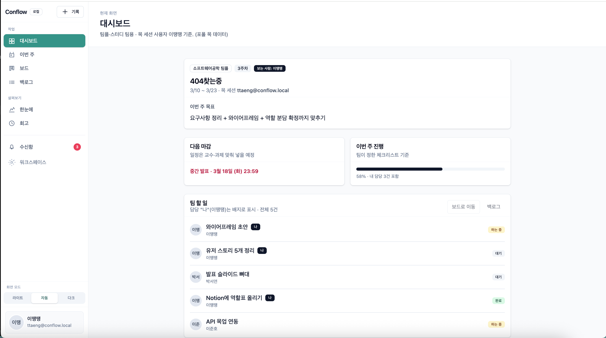
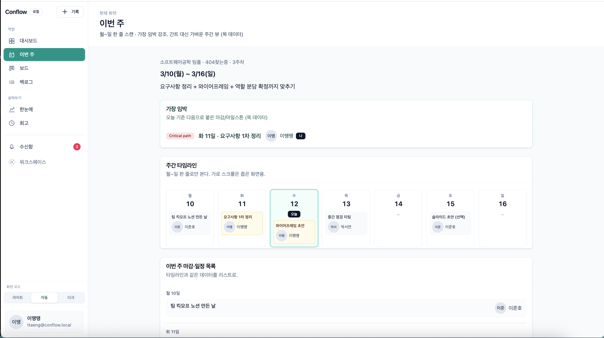

# Conflow

**"팀플의 병목(Blocker)을 뚫고, 마감을 잊지 않게 만드는 IT 협업 관제탑"**

카톡에 묻히는 마감 기한과 노션의 복잡한 문서화 사이에서 방황하는 **대학생·스터디 팀(ICP A)**을 위해 만들어진 초경량 협업 솔루션입니다.

## The Problem & Solution (비즈니스 로직)

| 문제점 (Pain Points) | 해결책 (Our Solutions)                                              |
| -------------------- | ------------------------------------------------------------------- |
| 무임승차와 병목 현상 | 대시보드 최상단에 Blocker(막힌 것) 섹션을 배치하여 협업 병목 가시화 |
| 마감 임박의 망각     | TanStack Start SSR을 활용한 D-Day 카운트다운 대시보드 즉시 노출     |
| 복잡한 툴 적응 실패  | 스프린트 등 어려운 용어 대신 '이번 주 목표' 중심의 직관적 UI/UX     |

## 3. Engineering Excellence (기술적 차별점)

### 🏗 Pragmatic FSD Architecture

단순 폴더 구조를 넘어, 비즈니스 확장을 고려한 Layered Monorepo 구조를 채택했습니다.

- **Core:** 인프라와 외부 어댑터 분리 (Adapter Pattern 적용)
- **Business:** UI와 완전히 분리된 Headless Logic (A2UI 도입 가능성 확보)
- **UI:** 원자적 디자인 시스템 기반의 재사용성 극대화

### 🤖 A2UI-Ready Design

모든 Feature는 독립적인 함수로 설계되어, 향후 AI 에이전트가 사람의 개입 없이도 비즈니스 로직을 실행하고 결과를 UI 스키마로 반환할 수 있는 구조를 갖추고 있습니다.

## 4. Tech Stack (The "Why")

- **TanStack Start (SSR):** 대시보드의 초기 로딩 속도 최적화 및 SEO/Type-safety 확보.
- **pnpm + Turborepo:** 패키지 간 의존성 관리 효율화 및 빌드 속도 향상.
- **Zod:** AI와 외부 API로부터 들어오는 데이터의 무결성을 보장하는 강력한 검증 레이어.

## 5. Roadmap (MVP Focus)

- [x] **Phase 1 (MVP):** 대시보드, 이번 주 할 일, Blocker 추적 (목 데이터 기반)
- [ ] **Phase 2:** AI 기반 회의록 요약 및 자동 할 일 할당 (A2UI 실제 적용)
- [ ] **Phase 3:** Slack/Discord 연동 어댑터 구현

## 6. WireFrame Example

### 대시보드

### 이번 주

