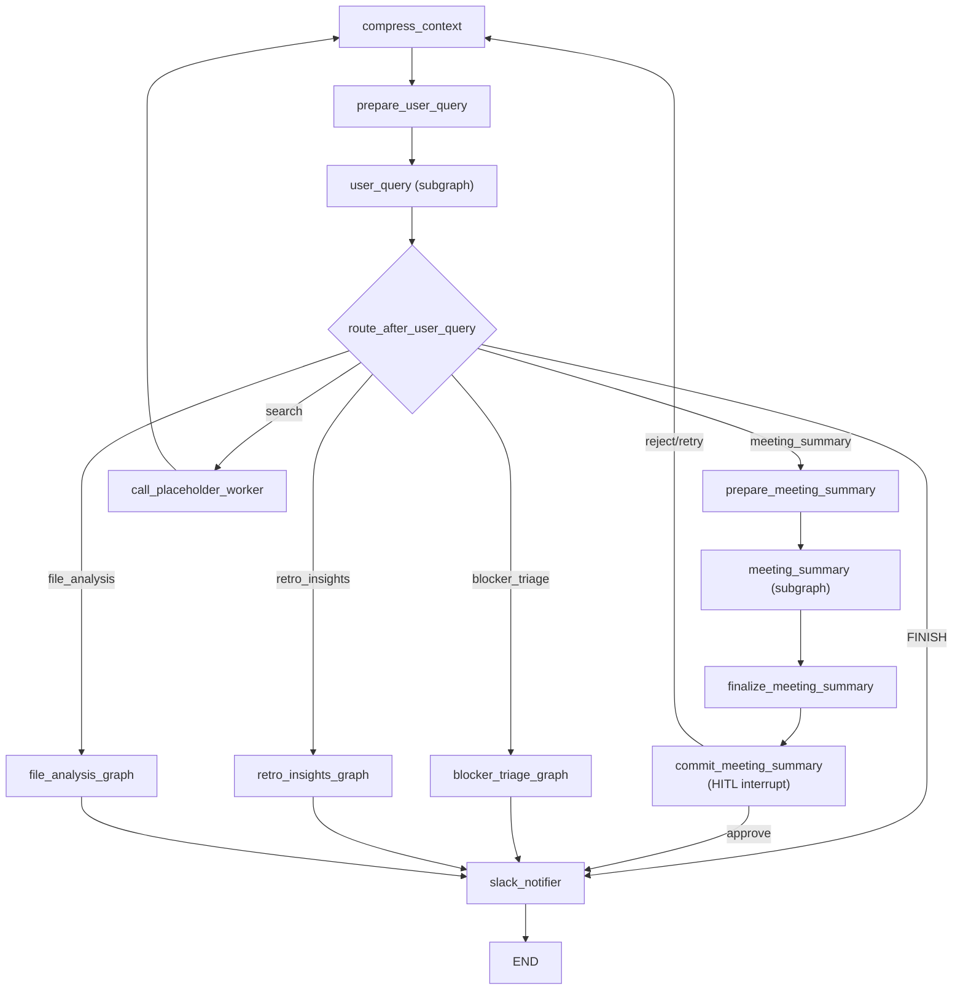

# 그래프 상세

Conflow의 Multi-Agent 시스템은 `supervisor_graph`가 `user_query` subgraph를 통해 의도를 분류하고, 적절한 worker graph로 라우팅하는 구조입니다.

## 그래프 로드맵

| Graph ID | 상태 | 입력 | 출력 (A2UI / API) |
|----------|------|------|-------------------|
| `user_query` | 로컬 구현 (v0) | `current_task`, `chat_history`, `agent_output?` | `next_agent`, `intent_text`, `detected_urls`, `route_reason` |
| `meeting_summary` | 로컬 구현 (mock/LLM v0) | `meeting_title`, `transcript`, `team_context?` | `overview`, `bullets`, `decisions`, `actions[]`, `next_steps[]` |
| `supervisor_graph` | v0 routing + worker subgraph 연동 | 자연어 task/chat + 선택적 worker 입력 | worker 결과 + routing metadata |
| `blocker_triage` | 로컬 구현 (mock/LLM v0) | `current_task`, `chat_history?`, `team_context?` | `detected_blockers[]`, `summary`, `agent_mode` |
| `retro_insights` | 로컬 구현 (mock/LLM v0) | `current_task`, `chat_history?`, `team_context?` | `detected_insights[]`, `team_pulse_score`, `summary` |
| `file_analysis` | 로컬 구현 (mock/LLM v0) | `file_info_list?`, `user_question?`, `file_task?` | `file_process_results[]`, `structured_response` |
| `search` | 라우팅만 구현 | 검색/조회 의도 | placeholder text |

## supervisor_graph

supervisor는 전체 오케스트레이션을 담당합니다. 컨텍스트 압축, 의도 분류, worker 실행, HITL(Human-in-the-Loop) 리뷰를 조율합니다.

### 실행 흐름



### 주요 노드

| 노드 | 역할 |
|------|------|
| `compress_context` | 대화 이력이 길어지면 요약하여 컨텍스트 윈도우 관리 (MAX_WINDOW_SIZE: 6) |
| `prepare_user_query` | supervisor state를 user_query subgraph 입력 형식으로 정규화 |
| `user_query` | 사용자 의도를 분류하고 `next_agent`를 결정 |
| `prepare_meeting_summary` | transcript, meeting_title 등을 meeting_summary subgraph 입력으로 매핑 |
| `finalize_meeting_summary` | subgraph 출력을 supervisor 형식으로 포맷 |
| `commit_meeting_summary` | HITL interrupt -- 사용자가 approve/reject 결정 |
| `slack_notifier` | 처리 완료 후 Slack MCP 알림 전송 |

## user_query

사용자 입력의 의도를 분류하여 적절한 worker로 라우팅합니다.

**입력**:
- `current_task`: 현재 작업 설명
- `chat_history`: 대화 이력
- `agent_output?`: 이전 에이전트의 출력 (재라우팅 시)

**출력**:
- `next_agent`: 라우팅 대상 (`meeting_summary`, `blocker_triage`, `retro_insights`, `file_analysis`, `search`, `FINISH`)
- `intent_text`: 분류된 의도 텍스트
- `detected_urls`: 감지된 URL 목록
- `route_reason`: 라우팅 이유

:::info
`CONFLOW_AGENT_MODE=llm`에서 LLM 라우팅이 실패하면 자동으로 rule-based 라우팅으로 fallback합니다.
:::

## meeting_summary

허들 회의 transcript를 구조화된 회의록으로 변환합니다.

### 파이프라인

```
START → validate_input → summarize → END
```

**입력**:
- `meeting_title`: 회의 제목
- `transcript`: 전사 본문 (필수)
- `team_context?`: 팀 컨텍스트 (예: "대학 스터디 팀, 1주 스프린트")

**출력**:
- `overview`: 회의 개요
- `bullets`: 주요 논의 사항
- `decisions`: 결정 사항
- `actions[]`: 액션 아이템 목록
- `next_steps[]`: 다음 단계
- `agent_mode`: 실행된 에이전트 모드
- `error?`: 에러 메시지 (있을 경우)

**예시 입력**:
```json
{
  "meeting_title": "FE 스터디 -- 스프린트 계획",
  "transcript": "이번 주는 보드 WIP 3으로 제한하기로 했고, 금요일 데모는 스테이징 배포와 스크린샷 1장을 완료 기준으로 한다.",
  "team_context": "대학 스터디 팀, 1주 스프린트"
}
```

## blocker_triage

대화 또는 작업 설명에서 블로커를 감지하고 분류합니다.

**입력**:
- `current_task`: 현재 작업/상황 설명
- `chat_history?`: 대화 이력
- `team_context?`: 팀 컨텍스트

**출력**:
- `detected_blockers[]`: 감지된 블로커 목록 (각 블로커에 근거 포함)
- `summary`: 블로커 요약
- `agent_mode`: 실행된 에이전트 모드

**예시 입력**:
```json
{
  "current_task": "백엔드 API가 아직 안 열려서 FE 작업이 막혔어",
  "chat_history": [
    { "type": "human", "content": "백엔드 API 때문에 프론트 작업이 막힘" }
  ]
}
```

## retro_insights

팀 회고 데이터에서 인사이트를 추출합니다.

**입력**:
- `current_task`: 회고 관련 작업 설명
- `chat_history?`: 대화 이력
- `team_context?`: 팀 컨텍스트

**출력**:
- `detected_insights[]`: KPT (Keep, Problem, Try) 인사이트
- `team_pulse_score`: 팀 건강도 점수
- `summary`: 회고 요약
- `agent_mode`: 실행된 에이전트 모드

## file_analysis

파일 메타데이터를 분석하고 구조화된 결과를 생성합니다.

**입력**:
- `file_info_list?`: 분석할 파일 메타데이터 목록
- `user_question?`: 파일에 대한 사용자 질문
- `file_task?`: 파일 작업 유형

**출력**:
- `file_process_results[]`: 파일별 분석 결과
- `structured_response`: 구조화된 응답

**예시 입력**:
```json
{
  "current_task": "Analyze https://cdn.example.com/spec.pdf",
  "chat_history": [
    { "type": "human", "content": "이 PDF 요구사항 분석해줘" }
  ]
}
```

## HITL (Human-in-the-Loop)

`meeting_summary` worker는 HITL interrupt를 지원합니다. `commit_meeting_summary` 노드에서 실행이 일시 중지되며, 사용자가 `approve` 또는 `reject`를 선택할 수 있습니다.

- **approve**: 회의록을 확정하고 `slack_notifier`를 통해 알림 전송
- **reject**: `compress_context`로 돌아가 재시도
