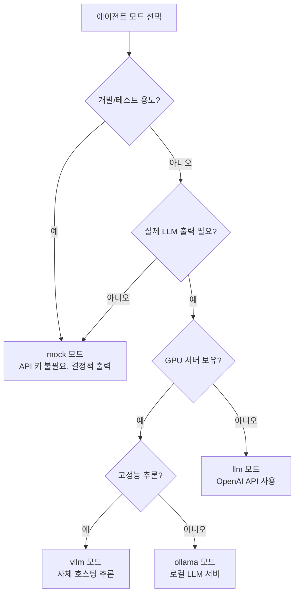

# 에이전트 모드

Conflow의 에이전트 시스템은 `CONFLOW_AGENT_MODE` 환경 변수를 통해 4가지 실행 모드를 지원합니다. 이를 통해 개발 단계, 테스트, 프로덕션 환경에 맞는 유연한 운영이 가능합니다.

## 모드 비교

| 모드     | API 키 필요           | 용도                              | 비용             |
| -------- | --------------------- | --------------------------------- | ---------------- |
| `mock`   | 아니오                | 로컬 개발, 테스트, Studio 시연    | 무료             |
| `llm`    | 예 (`OPENAI_API_KEY`) | 실제 LLM 출력이 필요한 경우       | 유료             |
| `ollama` | 아니오 (로컬 서버)    | 로컬 LLM 서버 사용                | 무료             |
| `vllm`   | 설정에 따라 다름      | OpenAI-compatible vLLM 엔드포인트 | 설정에 따라 다름 |

## mock 모드

```bash
CONFLOW_AGENT_MODE=mock
```

**기본 모드**입니다. 모든 에이전트가 API 키 없이 결정적(deterministic) 스텁 데이터를 반환합니다.

### 특징

- 외부 API 호출 없음
- 결정적 출력으로 재현 가능한 테스트
- LangGraph Studio에서 전체 플로우 시각화 가능
- CI/CD 파이프라인에서 안정적인 테스트

### 적용 범위

- `meeting_summary`: 미리 정의된 회의록 구조 반환
- `blocker_triage`: 샘플 블로커 목록 반환
- `retro_insights`: 샘플 KPT 인사이트 반환
- `file_analysis`: 샘플 분석 결과 반환
- `user_query`: Rule-based 키워드 라우팅

### 사용 예시

```bash
cd server

# mock 모드로 스모크 테스트
CONFLOW_AGENT_MODE=mock uv run python scripts/smoke_meeting_summary.py

# mock 모드로 pytest 실행
CONFLOW_AGENT_MODE=mock uv run pytest -q
```

## llm 모드

```bash
CONFLOW_AGENT_MODE=llm
OPENAI_API_KEY=sk-...
```

실제 OpenAI API를 호출하여 구조화된 LLM 출력을 생성합니다.

### 특징

- gpt-4o-mini를 기본 모델로 사용
- `LLMFactory`를 통해 모델 교체 가능
- 구조화된 출력 (structured output) 스키마 강제
- LLM 라우팅 실패 시 rule-based fallback

### Fallback 동작

`user_query` 그래프에서 LLM 라우팅이 실패하면:

1. API 키가 없는 경우 -> rule-based 라우팅
2. LLM 응답 파싱 실패 -> rule-based 라우팅
3. API 오류 -> error 반환 또는 rule-based fallback

### 비용 관리

:::warning
초기 개발 단계에서는 불필요한 API 비용을 방지하기 위해 `mock` 모드를 우선 사용하세요. `llm` 모드는 핵심 라우팅과 state contract가 안정화된 후 사용을 권장합니다.
:::

## ollama 모드

```bash
CONFLOW_AGENT_MODE=ollama
```

로컬에서 실행되는 [Ollama](https://ollama.ai) 서버를 LLM 백엔드로 사용합니다.

### 특징

- 로컬 GPU에서 실행되어 API 비용 없음
- 네트워크 의존성 없음
- 모델 선택의 자유 (llama3, mistral 등)

### 사전 요구사항

```bash
# Ollama 설치 (macOS)
brew install ollama

# 모델 다운로드
ollama pull llama3

# Ollama 서버 실행
ollama serve
```

## vllm 모드

```bash
CONFLOW_AGENT_MODE=vllm
```

OpenAI-compatible API를 제공하는 [vLLM](https://docs.vllm.ai) 엔드포인트를 사용합니다.

### 특징

- 고성능 추론 서버
- OpenAI API 호환 인터페이스
- 자체 호스팅 또는 클라우드 배포 가능

## 모드 선택 가이드



## 환경 변수 설정

```bash
# server/.env

# 에이전트 모드 (필수)
CONFLOW_AGENT_MODE=mock

# OpenAI API (llm 모드 시 필수)
OPENAI_API_KEY=sk-...

# Ollama 설정 (ollama 모드 시)
# 기본 URL: http://localhost:11434

# vLLM 설정 (vllm 모드 시)
# OpenAI-compatible 엔드포인트 URL 설정
```
