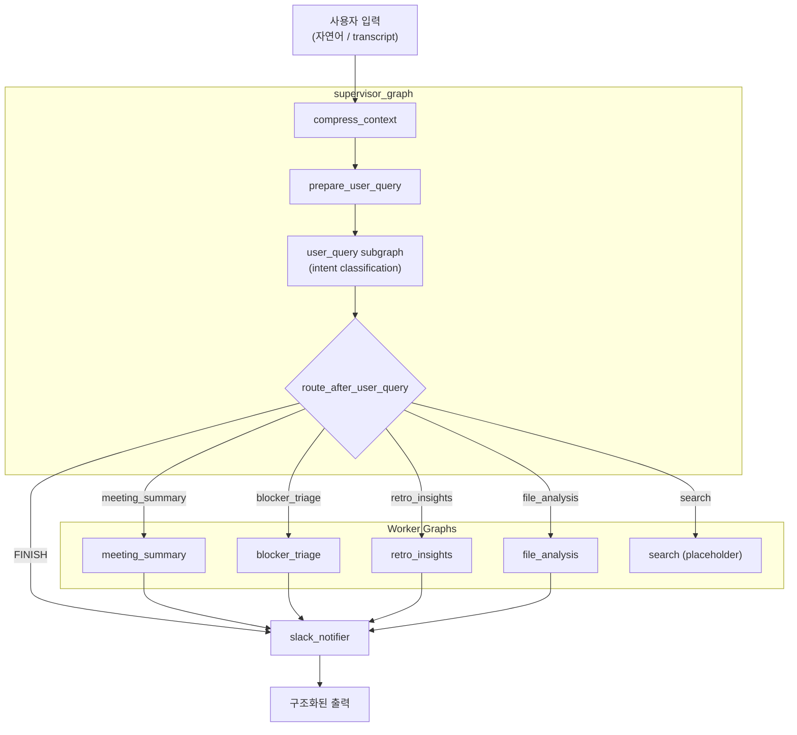

# Multi-Agent 시스템 개요

Conflow의 Multi-Agent 시스템은 **LangGraph** 기반으로 구축되었습니다. 단순히 협업 UI를 대체하는 것이 아니라, 팀이 놓치기 쉬운 정보를 구조화하여 대시보드, 보드, 수신함에 넣을 수 있는 데이터를 생성하는 **백엔드 워커**입니다.

## 왜 Multi-Agent인가?

### 전문성 및 모듈성

각 에이전트는 `meeting_summary`, `blocker_triage`, `retro_insights`와 같이 특정 도메인에 특화됩니다. 거대한 단일 에이전트보다 개발, 테스트, 유지보수가 용이하며 새로운 기능 추가 시 기존 시스템에 미치는 영향을 최소화합니다.

### 복잡성 분산 및 확장성

실제 팀 협업 환경의 문제는 매우 복합적입니다. Multi-Agent는 이러한 복잡성을 여러 에이전트에 분산시키며, 특정 에이전트의 부하가 높을 경우 해당 에이전트만 독립적으로 확장할 수 있습니다.

### 견고성 및 내결함성

일부 에이전트의 오류가 전체 시스템을 중단시키지 않습니다. 문제가 발생한 에이전트만 격리하여 처리하고, 나머지 에이전트는 계속 동작합니다.

### A2UI-Ready 시너지

각 에이전트가 명확한 Input/Output 스키마를 가지므로, AI 오케스트레이션 레이어가 각 에이전트를 호출하고 결과를 조합하기에 용이합니다.

## AI 엔지니어링 5가지 패턴

Conflow의 에이전트 시스템은 다음 5가지 AI 엔지니어링 패턴을 따릅니다:

| 패턴                       | 적용                                                                      |
| -------------------------- | ------------------------------------------------------------------------- |
| **Models**                 | OpenAI gpt-4o-mini를 기본 모델로 사용. `LLMFactory`를 통해 모델 교체 가능 |
| **Prompting**              | 각 worker graph에 도메인 특화 프롬프트 적용                               |
| **Context (RAG)**          | pgvector 기반 RAG 서비스로 외부 문서 컨텍스트 보강                        |
| **Orchestration (Agents)** | LangGraph supervisor가 worker subgraph를 오케스트레이션                   |
| **Evals & Observability**  | Mock 모드로 결정적 테스트, LangGraph Studio로 실행 추적                   |

## 아키텍처 구조



## 에이전트 목적과 해결 과제

| Pain Point    | 에이전트가 하는 일                                                        |
| ------------- | ------------------------------------------------------------------------- |
| 병목/무임승차 | 회의/채팅에서 **Blocker**와 담당 공백을 추출하여 알림/보드 후보로 제안    |
| 마감 망각     | 논의에서 **마감/다음 단계**를 구조화하여 인박스에 반영 가능한 형태로 출력 |
| 도구 피로     | Notion 대신 **한 줄 요약 + 액션 리스트** (MeetingSummary 스키마 준수)     |

## FastAPI와의 통합

- **현재**: LangGraph CLI (`langgraph dev`)가 Agent Server를 별도 포트(2024)에서 실행
- **향후**: FastAPI에서 `langgraph_sdk`를 통해 에이전트를 호출하고, 결과를 REST API로 반환하며 DB에 저장

```
FastAPI Request → Agent Orchestrator → Individual Agent → Processed Data → API Response + DB Storage
```

## 관련 문서

- [각 그래프 상세](/docs/agents/graphs) -- supervisor 및 worker graph의 구조와 입출력
- [에이전트 모드](/docs/agents/modes) -- mock, llm, ollama, vllm 모드 설명
