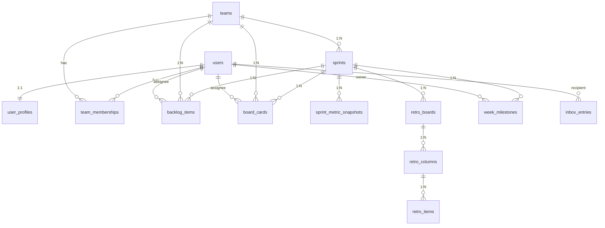

# 데이터베이스 설계

Conflow는 **PostgreSQL 16 + pgvector**를 사용합니다. 비동기 SQLAlchemy 2와 Alembic으로 ORM 및 마이그레이션을 관리합니다.

## 설계 원칙

1. **워크스페이스 단위**: 비즈니스 데이터는 `teams`에 귀속됩니다. 사용자는 `team_memberships`로 팀에 속하고 역할을 가집니다.
2. **계정 vs 확장 속성**: 인증/식별은 `users`, 표시/환경 등 확장은 `user_profiles`에 분리합니다. 프로필은 사용자당 하나(1:1)입니다.
3. **스프린트 허브**: 목업 도메인(backlog, board, inbox, metric, retro, week)은 공통으로 `sprints`를 참조하여 한 스프린트 컨텍스트에 묶입니다.
4. **다대다 관리**: 사용자와 팀의 N:M 관계는 `team_memberships`만 사용합니다.
5. **식별 및 삭제**: PK는 UUID. `created_at` / `updated_at` / `deleted_at` 패턴으로 감사와 소프트 삭제를 지원합니다.

## ER 다이어그램



## 도메인별 테이블 관계

### 1. 계정 / 프로필 / 팀

| 관계 | 카디널리티 | 설명 |
|------|-----------|------|
| `users` -- `user_profiles` | **1:1** | 계정당 프로필 하나. FK는 프로필 쪽 (`user_uuid`) |
| `users` -- `teams` | **N:M** | `team_memberships`로 분해. 역할/가입 시각은 조인 테이블에 저장 |
| `team_memberships` -> `users` | **N:1** | 멤버십은 단일 사용자를 가리킴 |
| `team_memberships` -> `teams` | **N:1** | 멤버십은 단일 팀을 가리킴 |

동일 `(user_uuid, team_uuid)` 조합은 복합 유니크 제약으로 한 행만 허용합니다.

### 2. 스프린트

| 관계 | 카디널리티 | 설명 |
|------|-----------|------|
| `sprints` -> `teams` | **N:1** | 스프린트는 하나의 팀에 속함 |

### 3. 애자일 위젯

모두 `teams` 및 `sprints`에 종속되며, 필요 시 `users`를 참조합니다.

| 테이블 | 팀 | 스프린트 | 사용자 | 비고 |
|--------|-----|---------|--------|------|
| `backlog_items` | N:1 | N:1 | N:1 (선택) | 담당자 등은 사용자 FK |
| `board_cards` | N:1 | N:1 | N:1 (복수 가능) | 보고자/담당 등 역할별 사용자 참조 |
| `inbox_entries` | -- | -- | N:1 (복수 FK) | 서로 다른 사용자 역할은 컬럼 분리 |
| `sprint_metric_snapshots` | -- | N:1 | -- | 시계열/JSON 스냅샷 |

### 4. 회고 (Retro)

| 관계 | 카디널리티 | 설명 |
|------|-----------|------|
| `retro_boards` -> `sprints` | **N:1** | 회고 보드는 스프린트에 속함 |
| `retro_columns` -> `retro_boards` | **N:1** | KPT 등 컬럼은 보드에 속함 |
| `retro_items` -> `retro_columns` | **N:1** | 카드 한 줄은 하나의 컬럼에 속함 |

### 5. 주간 마일스톤

| 관계 | 카디널리티 | 설명 |
|------|-----------|------|
| `week_milestones` -> `sprints` | **N:1** | 특정 스프린트 기준 |
| `week_milestones` -> `users` | **N:1** | 담당자/소유자 참조 |

## 마이그레이션 관리

Alembic을 사용하여 스키마 변경을 관리합니다:

```bash
cd server

# 마이그레이션 파일 자동 생성
uv run alembic revision --autogenerate -m "add new column"

# 마이그레이션 적용
uv run alembic upgrade head

# 마이그레이션 롤백 (하나 이전)
uv run alembic downgrade -1
```

:::caution
마이그레이션 생성 전에 반드시 `docker compose up db`로 데이터베이스가 실행 중인지 확인하세요.
:::

## pgvector

RAG 서비스(`packages/rag`)에서 벡터 유사도 검색을 위해 pgvector 확장을 사용합니다. PostgreSQL 이미지는 `pgvector/pgvector:pg16`을 사용하여 확장이 사전 설치되어 있습니다.
