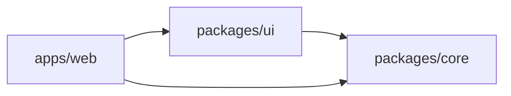

# 모노레포 구조

Conflow는 **pnpm 9 + Turborepo** 기반의 모노레포로 구성됩니다. 프론트엔드 workspace와 Python 백엔드가 하나의 저장소에서 관리됩니다.

## 디렉터리 레이아웃

```
conflow/
├── apps/
│   └── web/                 # Vite + React 18 + Tailwind CSS 4
│       ├── src/
│       │   ├── pages/       # 페이지 컴포넌트
│       │   ├── widgets/     # 위젯 컴포넌트
│       │   ├── App.tsx
│       │   └── main.tsx
│       ├── vite.config.ts
│       └── package.json
│
├── packages/
│   ├── core/                # 공유 인프라
│   │   ├── src/
│   │   │   ├── axios/       # HTTP 클라이언트 설정
│   │   │   ├── zod/         # Zod 스키마 및 검증
│   │   │   └── utils/       # 날짜, 문자열 유틸리티
│   │   └── package.json
│   │
│   ├── ui/                  # Atomic React 컴포넌트
│   │   ├── src/
│   │   │   ├── Button/
│   │   │   ├── Card/
│   │   │   ├── Avatar/
│   │   │   └── ...
│   │   └── package.json
│   │
│   └── rag/                 # Python RAG 서비스
│       ├── Dockerfile
│       └── ...              # FastAPI :8001, pgvector
│
├── server/                  # FastAPI 백엔드
│   ├── src/app/
│   │   ├── core/            # DB, Security, Config, LLM Factory
│   │   ├── agent/graphs/    # LangGraph Multi-Agent
│   │   ├── sandbox/         # AI 런타임 보안
│   │   ├── common/          # 멱등성, Circuit Breaker, 캐싱
│   │   ├── websockets/      # Huddle, DM 시그널링
│   │   ├── user/            # 사용자 도메인
│   │   ├── team/            # 팀 도메인
│   │   ├── sprint/          # 스프린트 도메인
│   │   ├── backlog/         # 백로그 도메인
│   │   ├── board/           # 보드 도메인
│   │   ├── inbox/           # 인박스 도메인
│   │   ├── week/            # 주간 마일스톤 도메인
│   │   ├── retro/           # 회고 도메인
│   │   └── planning/        # 플래닝 도메인
│   ├── alembic/             # DB 마이그레이션
│   ├── tests/               # pytest 테스트
│   ├── scripts/             # 스모크 테스트 스크립트
│   ├── main.py              # FastAPI 앱 엔트리포인트
│   └── pyproject.toml       # uv 프로젝트 설정
│
├── docs/                    # 아키텍처 문서, 와이어프레임
├── docs-site/               # Docusaurus 문서 사이트 (이 사이트)
├── docker-compose.yml
├── package.json             # 루트 (Turborepo scripts)
├── pnpm-workspace.yaml
└── turbo.json
```

## 의존성 흐름

패키지 간 의존성은 단방향으로만 허용됩니다:



### 규칙
- `packages/core`는 다른 workspace 패키지에 의존하지 않음
- `packages/ui`는 `packages/core`에만 의존
- `apps/web`은 `packages/ui`와 `packages/core`에 의존
- **순환 의존성 금지**: 어떤 패키지도 자신에게 의존하는 패키지를 import할 수 없음

## 도메인 모듈 패턴

Backend의 각 도메인 모듈은 동일한 구조를 따릅니다:

```
server/src/app/{domain}/
├── api.py        # FastAPI 라우터 정의
├── model.py      # SQLAlchemy ORM 모델
├── schemas.py    # Pydantic 스키마 (Request/Response)
└── service.py    # 비즈니스 로직
```

이 패턴은 관심사 분리를 강제하며, 각 레이어는 독립적으로 테스트할 수 있습니다.

## Turborepo 설정

`turbo.json`을 통해 빌드 파이프라인이 정의됩니다:

- `pnpm dev` -- 모든 workspace의 `dev` 스크립트를 병렬 실행
- `pnpm build` -- 의존성 순서를 고려한 빌드 (core -> ui -> web)
- `pnpm test` -- 모든 테스트 병렬 실행
- `pnpm typecheck` -- TypeScript 타입 검사
- `pnpm lint` -- 전체 린트

Turborepo는 빌드 캐시를 활용하여 변경되지 않은 패키지의 재빌드를 건너뜁니다.

## Python 패키지 관리

Backend는 모노레포 내에 있지만 pnpm workspace와는 별도로 **uv**로 관리됩니다:

```bash
cd server
uv sync --group agent --group dev
```

의존성 그룹:
- **기본**: FastAPI, SQLAlchemy, Pydantic 등 핵심 의존성
- **agent**: LangGraph, LangChain, OpenAI 등 에이전트 의존성
- **dev**: pytest, ruff, mypy 등 개발 도구
