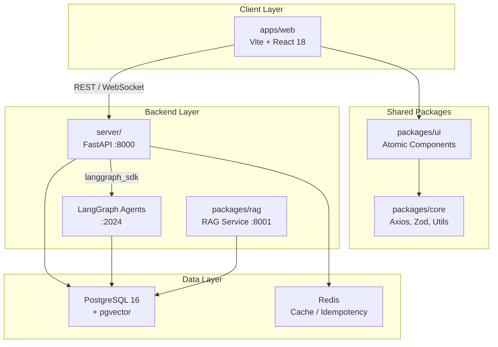

# 아키텍처 개요

Conflow는 **A2UI-Ready (AI-to-UI)** 아키텍처를 채택하여, 모든 비즈니스 로직이 headless하게 동작하며 LangGraph 에이전트가 직접 호출할 수 있도록 설계되었습니다.

## 시스템 구성도



## 핵심 설계 원칙

### 1. A2UI-Ready Design

비즈니스 로직은 React 생명주기와 분리되어 headless로 동작합니다. 모든 기능은 명확한 Input/Output Schema (Zod)를 가지며, AI 에이전트가 프로그래밍 방식으로 호출할 수 있습니다.

```
사용자 요청 → Agent Orchestrator → Individual Agent → Processed Data → API Response / DB Storage
```

### 2. Schema-First

모든 외부 데이터(API 응답, AI 출력)는 반드시 Zod로 검증합니다. 이를 통해:
- AI 에이전트의 구조화된 출력을 보장
- API 계약의 타입 안전성 확보
- 런타임 데이터 검증 자동화

### 3. Layer Isolation

패키지 간 순환 의존성을 허용하지 않습니다:

```
apps/web → packages/ui → packages/core
```

각 도메인 모듈(`user/`, `team/`, `sprint/` 등)은 독립적인 `api.py`, `model.py`, `schemas.py`, `service.py`로 구성됩니다.

### 4. Immutability

프론트엔드 코드에서 `let`을 사용하지 않고 항상 `const`를 사용합니다. `map`/`filter`/`reduce`로 데이터를 변환하며, `any` 타입 대신 `unknown` 또는 strict interface를 사용합니다.

## 통신 패턴

### REST API
- Frontend와 Backend 간 주요 통신 방식
- FastAPI의 자동 OpenAPI 문서 생성 (`/docs`)
- JWT 기반 인증 (Supabase Auth)

### WebSocket
- 실시간 Huddle 시그널링
- DM (Direct Message) 기능
- `server/src/app/websockets/`에서 관리

### Agent Integration
- 현재: LangGraph CLI가 별도 포트(2024)에서 Agent Server 실행
- 향후: FastAPI에서 `langgraph_sdk`를 통해 에이전트 호출 후 결과를 REST API로 반환 및 DB 저장

## 보안

- **JWT 인증**: Supabase Auth 연동, `server/src/app/core/security.py`
- **Sandbox 실행**: AI 에이전트의 런타임 보안 (`server/src/app/sandbox/`)
  - syscall 차단
  - 경로 검증
- **CORS**: `CORS_ALLOWED_ORIGINS` 환경 변수로 허용 도메인 관리
- **Idempotency**: Redis 기반 멱등성 보장 (`server/src/app/common/`)
- **Circuit Breaker**: 외부 서비스 장애 전파 방지

## 관련 문서

- [모노레포 구조](/docs/architecture/monorepo) -- 디렉터리 레이아웃과 의존성 흐름
- [데이터베이스 설계](/docs/architecture/database) -- 테이블 관계와 설계 원칙
- [Multi-Agent 시스템](/docs/agents/overview) -- AI 에이전트 아키텍처
