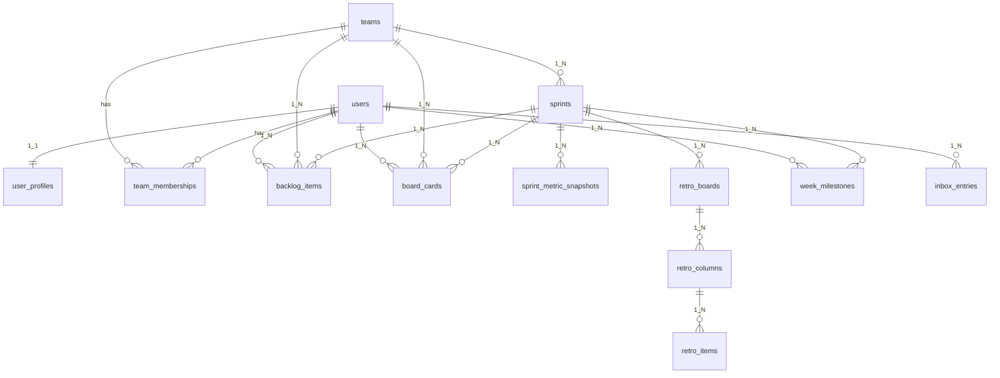

# Conflow 데이터베이스 테이블 관계

`server/erd.erd` 초안과 동일한 도메인을 전제로, **추구하는 논리적 관계(카디널리티)**를 정리한다. ER 도구 상 표시 오류와 무관하게, 스키마·마이그레이션(S SQLAlchemy/Alembic) 설계 시 이 문서를 기준으로 맞춘다.

## 범위와 출처

- **범위**: 계정·팀 워크스페이스, 스프린트·목업 애자일 위젯(backlog, board, inbox, metrics), 회고(retro), 이번 주 마일스톤(week).
- **출처**: ERD 메모 — _apps/web 목 데이터 기반 초안. enum·복합 유니크(`team_memberships` 등)는 마이그레이션에서 정의._

## 설계 원칙

1. **워크스페이스 단위**: 비즈니스 데이터는 가능하면 **`teams`에 귀속**한다. 사용자는 **`team_memberships`**로 팀에 속하고 역할을 가진다.
2. **계정 vs 확장 속성**: 인증·식별은 **`users`**, 표시·환경 등 확장은 **`user_profiles`**에 둔다. 프로필은 사용자당 **하나(1:1)**.
3. **스프린트 허브**: 목업 도메인(backlog, board, inbox, metric 스냅샷, retro 루트, week 마일스톤)은 공통으로 **`sprints`**를 참조해 한 스프린트 컨텍스트에 묶는다.
4. **다대다**: 사용자와 팀의 다대다는 **`team_memberships`**만 사용한다. 다른 테이블 간 직접 N:M은 두지 않는다.
5. **식별·삭제**: PK는 ERD상 **`uuid`**. 감사·소프트 삭제용 **`created_at` / `updated_at` / `deleted_at`** 패턴을 유지한다.

## 도메인별 관계

### 1. 계정·프로필·팀

| 관계                         | 카디널리티 | 설명                                                                                                          |
| ---------------------------- | ---------- | ------------------------------------------------------------------------------------------------------------- |
| `users` ↔ `user_profiles`    | **1 : 1**  | 계정당 프로필 행 하나. FK는 프로필 쪽(`user_uuid` 등).                                                        |
| `users` ↔ `teams`            | **N : M**  | **`team_memberships`**로 분해. 한 사용자는 여러 팀, 한 팀은 여러 사용자. 역할·가입 시각은 조인 테이블에 둔다. |
| `team_memberships` → `users` | **N : 1**  | 멤버십은 단일 사용자를 가리킨다.                                                                              |
| `team_memberships` → `teams` | **N : 1**  | 멤버십은 단일 팀을 가리킨다.                                                                                  |

동일 `(user_uuid, team_uuid)` 조합은 한 행만 허용(복합 유니크)하는 것을 목표로 한다.

### 2. 스프린트·팀

| 관계                | 카디널리티 | 설명                           |
| ------------------- | ---------- | ------------------------------ |
| `sprints` → `teams` | **N : 1**  | 스프린트는 하나의 팀에 속한다. |

### 3. 목업 애자일 위젯 (백로그·보드·인박스·메트릭)

모두 **`teams`** 및 **`sprints`**에 종속되며, 필요 시 **`users`**를 참조한다.

| 테이블                    | 팀  | 스프린트 | 사용자               | 비고                                                              |
| ------------------------- | --- | -------- | -------------------- | ----------------------------------------------------------------- |
| `backlog_items`           | N:1 | N:1      | N:1 (선택)           | 백로그 항목은 팀·스프린트 범위; 담당자 등은 사용자 FK.            |
| `board_cards`             | N:1 | N:1      | N:1 (복수 컬럼 가능) | 칸반 카드; 보고자/담당 등 역할별 사용자 참조가 둘 이상일 수 있다. |
| `inbox_entries`           | —   | —        | N:1 (복수 FK 가능)   | 인박스 항목이 서로 다른 사용자 역할을 가리키면 컬럼을 분리한다.   |
| `sprint_metric_snapshots` | —   | N:1      | —                    | 스프린트당 시계열·JSON 스냅샷.                                    |

### 4. 회고 (Retro)

| 관계                             | 카디널리티 | 설명                                                                                                                            |
| -------------------------------- | ---------- | ------------------------------------------------------------------------------------------------------------------------------- |
| `retro_boards` → `sprints`       | **N : 1**  | 회고 보드는 스프린트당 하나 이상 가능하거나, 비즈니스 규칙에 따라 1:1로 제한할 수 있다. 문서화 목적상 FK는 **다대일(N:1)**이다. |
| `retro_columns` → `retro_boards` | **N : 1**  | KPT 등 컬럼은 보드에 속한다.                                                                                                    |
| `retro_items` → `retro_columns`  | **N : 1**  | 카드 한 줄은 하나의 컬럼에 속한다.                                                                                              |

### 5. 이번 주 마일스톤

| 관계                          | 카디널리티 | 설명                                                      |
| ----------------------------- | ---------- | --------------------------------------------------------- |
| `week_milestones` → `sprints` | **N : 1**  | 마일스톤 행은 특정 스프린트를 기준으로 한다.              |
| `week_milestones` → `users`   | **N : 1**  | 담당자·소유자 등 사용자 참조(스키마상 FK 한 개로 모델링). |

## 논리 다이어그램 (요약)

아래는 **추구하는 카디널리티**를 요약한 ER 개요이다. 실제 컬럼명은 마이그레이션과 일치시키면 된다.

## 체크리스트 (마이그레이션 시)

- [ ] `user_profiles.user_uuid` 유니크 제약으로 **1:1** 보장.
- [ ] `team_memberships`에 `(user_uuid, team_uuid)` 유니크 및 각 FK 인덱스.
- [ ] 팀·스프린트 하위 테이블에 `team_uuid` / `sprint_uuid` NOT NULL 정책 일관화.
- [ ] `board_cards`·`inbox_entries`처럼 **동일 엔티티에 사용자 FK가 여러 개**인 경우, 컬럼명으로 역할을 구분(예: `assignee_uuid`, `reporter_uuid`).

이 문서는 ERD 파일과 함께 갱신하며, 제품 요구가 바뀌면 카디널리티 표와 다이어그램을 먼저 수정한다.
